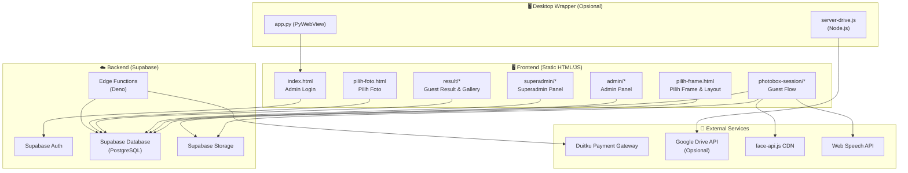
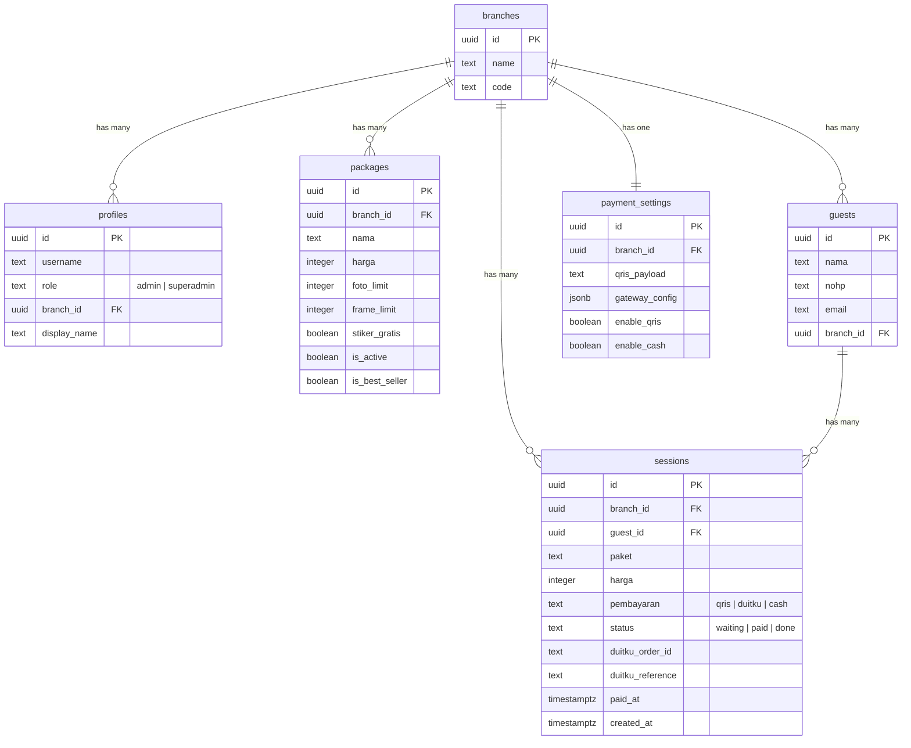
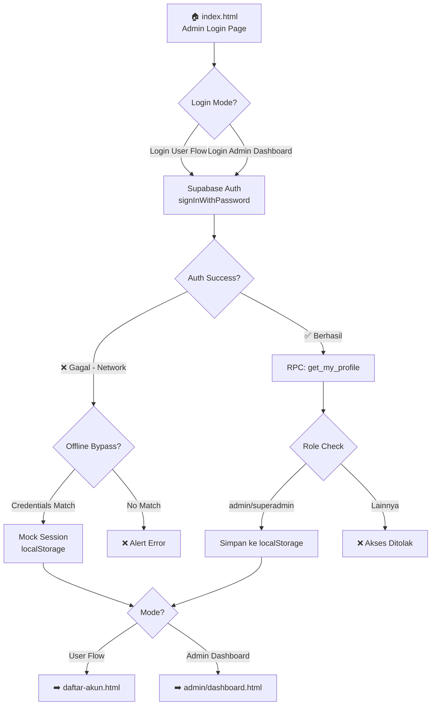
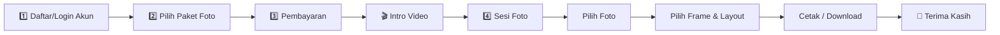

# 📋 Product Requirements Document (PRD)
# LTI Photobooth — AutoMoved System

| Field | Detail |
|---|---|
| **Nama Produk** | LTI Photobooth (AutoMoved) |
| **Versi Dokumen** | 2.0 (System v2 Update) |
| **Tanggal** | 26 Juli 2026 |
| **Status** | Active Development / Production Ready |
| **Platform** | Web Application + Desktop (PyWebView) |
| **Tech Stack** | HTML/CSS/JS, Supabase (BaaS), Deno Edge Functions, Duitku Payment Gateway, MediaPipe Gestures |

---

## 1. Ringkasan Produk (Executive Summary)

**LTI Photobooth** adalah sistem photobooth digital berbasis web yang memungkinkan bisnis rental photobooth mengelola seluruh alur operasional — mulai dari registrasi tamu, pemilihan paket, pembayaran digital, sesi foto interaktif dengan AI (face detection + voice control), pemilihan frame/stiker, hingga pencetakan dan pengunduhan hasil foto.

Sistem ini dirancang untuk berjalan di **perangkat kios/touchscreen** di lokasi photobooth, dengan dukungan manajemen multi-cabang melalui panel admin dan superadmin.

### Deployment URL
> **Production**: `https://axionix-two.vercel.app/`

---

## 2. Tujuan Produk (Product Goals)

| # | Tujuan | Indikator Sukses |
|---|--------|-----------------|
| 1 | **Digitalisasi penuh alur photobooth** — dari registrasi hingga cetak | 100% flow berjalan tanpa kertas/manual |
| 2 | **Self-service kiosk** — tamu bisa mengoperasikan tanpa bantuan staf | Rata-rata sesi selesai < 10 menit |
| 3 | **Multi-cabang** — satu sistem untuk banyak lokasi bisnis | Setiap cabang punya admin, paket, dan payment setting sendiri |
| 4 | **Pembayaran fleksibel** — QRIS manual & payment gateway (Duitku) | Transaksi otomatis terverifikasi via callback |
| 5 | **Pengalaman interaktif & modern** — face detection, voice control, pose preset | Engagement rate tinggi di sesi foto |

---

## 3. Target Pengguna (User Personas)

### 3.1 🧑‍💼 Superadmin
- **Deskripsi**: Pemilik bisnis / administrator tertinggi sistem
- **Kebutuhan**: Membuat akun admin baru, melihat statistik seluruh cabang, mengelola seluruh operasional
- **Akses**: Panel superadmin (`/superadmin/`)

### 3.2 👨‍💻 Admin (Cabang)
- **Deskripsi**: Operator di masing-masing cabang photobooth
- **Kebutuhan**: Mengelola paket foto, mengonfirmasi pembayaran, mengelola frame & stiker, memonitor sesi harian
- **Akses**: Panel admin (`/admin/`)

### 3.3 📸 Tamu (Guest / End User)
- **Deskripsi**: Pelanggan yang menggunakan layanan photobooth
- **Kebutuhan**: Daftar akun, pilih paket, bayar, sesi foto, pilih frame, cetak/download foto
- **Akses**: Alur photobox session (`/photobox-session/`)

---

## 4. Arsitektur Sistem

### 4.1 Diagram Arsitektur Tingkat Tinggi



### 4.2 Tech Stack Detail

| Layer | Teknologi | Fungsi |
|-------|-----------|--------|
| **Frontend** | HTML5, CSS3 (Vanilla), JavaScript (ES Modules) | UI & business logic |
| **Font** | Google Fonts (Poppins, Plus Jakarta Sans) | Typography |
| **UI Library** | Tidak ada framework (Vanilla JS) | Lightweight, zero-build |
| **Backend-as-a-Service** | Supabase | Auth, Database, Storage, Edge Functions |
| **Database** | PostgreSQL (via Supabase) | Data persistence |
| **Authentication** | Supabase Auth (email/password) | Admin & user auth |
| **Payment Gateway** | Duitku (via Supabase Edge Function) | Pembayaran online |
| **QRIS** | Custom dynamic QRIS generator (CRC16-CCITT) | Pembayaran offline |
| **Face Detection** | face-api.js v0.22.2 (TinyFaceDetector) | Deteksi kehadiran tamu |
| **Voice Control** | Web Speech API (SpeechRecognition + SpeechSynthesis) | Kontrol suara & sambutan |
| **Hand Gesture** | MediaPipe Hands | Deteksi gesture tangan |
| **QR Code** | qrcode (CDN) | Generate QR Code download |
| **GIF** | gifshot | Pembuatan GIF dari foto |
| **Desktop Wrapper** | PyWebView (Python) | Aplikasi desktop opsional |
| **File Server** | Node.js + Express (opsional) | Upload ke Google Drive |
| **Deployment** | Vercel | Hosting production |

---

## 5. Database Schema

### 5.1 Tabel Utama



### 5.2 Kolom Migrasi Duitku

| Kolom | Tipe | Default | Deskripsi |
|-------|------|---------|-----------|
| `duitku_order_id` | TEXT | NULL | merchantOrderId dari Duitku |
| `duitku_reference` | TEXT | NULL | Reference number dari Duitku |
| `paid_at` | TIMESTAMPTZ | NULL | Timestamp pembayaran selesai |

---

## 6. Fitur & Alur Pengguna (Features & User Flows)

### 6.1 🔐 Alur Autentikasi



**Fitur Autentikasi:**
- Login via Supabase Auth (email + password)
- Dua mode login: **User Flow** (menjalankan sesi photobooth) dan **Admin Dashboard** (kelola operasional)
- Fallback offline dengan kredensial hardcoded (`1@admin.com` / `1`) untuk testing
- Role-based access: hanya `admin` dan `superadmin` yang boleh login
- Session persistence via `localStorage` (`currentAdmin`, `userRole`, `branchId`, dll.)

---

### 6.2 📸 Alur Sesi Photobooth (Guest Flow)



#### Step 1: Daftar Akun (`daftar-akun.html`)

| Aspek | Detail |
|-------|--------|
| **Input** | Username (wajib), Email (opsional), No. HP (wajib), Checkbox S&K |
| **Validasi** | Cek duplikasi berdasarkan `nohp + nama + branch_id` |
| **Jika sudah terdaftar** | Login otomatis tanpa insert ulang |
| **Database** | Insert ke tabel `guests` |
| **Face Detection** | Kamera kecil di pojok mendeteksi kehadiran tamu. Jika idle 5 detik → status "Menunggu tamu". Ketika wajah kembali terdeteksi → putar suara sambutan via TTS |
| **Output** | `currentUser` tersimpan di localStorage → redirect ke `pilih-paket.html` |

> **Login Akun Alternatif** (`login-akun.html`): Tamu yang sudah pernah daftar bisa login langsung dengan nama + No. HP.

#### Step 2: Pilih Paket (`pilih-paket.html`)

| Aspek | Detail |
|-------|--------|
| **Data Source** | Tabel `packages` di Supabase, filter `branch_id` + `is_active = true` |
| **Layout** | Grid 4 kolom × 2 baris (maks 8 paket) |
| **Informasi** | Nama paket, deskripsi (jumlah foto, frame, stiker gratis), harga |
| **Filter** | Tab "Semua" dan "Best Seller 🔥" |
| **Limit Parsing** | Otomatis parse `foto_limit`, `frame_limit`, `stiker_gratis` dari deskripsi |
| **Output** | Paket tersimpan di `currentUser.paket` + `selectedPackage` di localStorage |
| **Paid Session Check** | Jika sudah ada `session_id` yang statusnya `paid`, langsung redirect ke intro video |

#### Step 3: Pembayaran (`pembayaran.html`)

| Aspek | Detail |
|-------|--------|
| **Metode Otomatis** | Sistem auto-detect dari `payment_settings`: jika `mode = manual` + `qris_payload` ada → QRIS; selain itu → Duitku |
| **QRIS Manual** | Dynamic QRIS generator (CRC16-CCITT), QR berlaku 5 menit, polling status per 3 detik |
| **Duitku Gateway** | Invoke Supabase Edge Function `create-duitku-transaction`, redirect ke halaman pembayaran Duitku |
| **Callback Duitku** | Edge Function `duitku-callback` menerima POST dari Duitku, validasi signature MD5, update status session ke `paid` |
| **Return URL** | Setelah Duitku selesai, redirect kembali dengan `resultCode` → `00` = sukses → lanjut ke intro video |
| **Session** | Insert ke tabel `sessions` dengan status `waiting` → update ke `paid` saat konfirmasi |
| **Caching** | Payment settings di-cache di localStorage per `branch_id` untuk loading instan |

#### Step 4: Intro Video (`intro-video.html`)

| Aspek | Detail |
|-------|--------|
| **Fungsi** | Menampilkan video intro/tutorial sebelum sesi foto dimulai |
| **Fitur** | Tombol "Skip" muncul setelah 1.5 detik, auto-redirect setelah video selesai |
| **UI** | Fullscreen, cursor hidden, immersive experience |

#### Step 5: Sesi Foto (`sesi-foto.html`)

| Aspek | Detail |
|-------|--------|
| **Layout** | Split screen: Kiri (65%) live webcam, Kanan (35%) galeri foto real-time |
| **Face Detection** | Badge "Active/Idle" di pojok kiri atas webcam |
| **Voice Control** | 10 preset pose dikenali via Speech Recognition (bahasa Indonesia `id-ID`) |
| **Hand Gesture** | MediaPipe Hands untuk deteksi gesture tangan |
| **Countdown** | Animasi countdown 3..2..1 sebelum capture |
| **Galeri Live** | Foto terbaru muncul di atas dengan badge "✨ TERBARU", hover → tombol hapus |
| **TTS** | Instruksi pose diucapkan melalui Web Speech TTS |
| **Limit** | Jumlah foto dibatasi sesuai `paket.foto_limit` |

**10 Preset Pose:**

| # | Label | Voice Trigger |
|---|-------|--------------|
| 1 | Senyum 😊 | "senyum", "satu", "1" |
| 2 | V-Sign ✌️ | "v sign", "dua", "2" |
| 3 | Merapat 🤝 | "merapat", "tiga", "3" |
| 4 | Lompat 🏃 | "loncat", "lompat", "empat" |
| 5 | Cool 😎 | "keren", "cool", "lima" |
| 6 | Tangan ✋ | "tangan atas", "enam" |
| 7 | Selfie 🤳 | "selfie", "tujuh" |
| 8 | Santai 🧘 | "duduk", "santai", "delapan" |
| 9 | Berpose 💃 | "pose", "berpose", "sembilan" |
| 10 | Tertawa 😂 | "tertawa", "ketawa", "sepuluh" |

#### Step 6: Pilih Foto (`pilih-foto.html`)

| Aspek | Detail |
|-------|--------|
| **Fungsi** | Menampilkan semua foto yang diambil dari sesi, tamu memilih foto favorit |
| **Limit** | Sesuai `paket.foto_limit` |
| **Navigasi** | Lanjut ke halaman pilih frame & layout |

#### Step 7: Pilih Frame & Layout (`pilih-frame.html`)

| Aspek | Detail |
|-------|--------|
| **Preview** | Canvas preview real-time |
| **Stiker** | Layer stiker drag-and-drop di atas canvas |
| **Frame** | Pilihan frame dari database (kelola via admin) |
| **GIF** | Dukungan pembuatan GIF dari foto menggunakan `gifshot` |
| **Upload** | Auto-upload ke Supabase Storage atau Google Drive |
| **Cetak** | Tombol cetak → halaman cetak/download |

#### Step 8: Cetak & Download (`result/cetak.html` & `result/download.html`)

| Aspek | Detail |
|-------|--------|
| **Upload** | Otomatis upload ke Google Drive (jika backend aktif) → fallback Supabase Storage (signed URL 7 hari) |
| **QR Code** | Generate QR Code dari link download |
| **Scan** | Tamu scan QR dengan HP untuk download foto |

#### Step 9: Terima Kasih (`halaman-terakhir-foto.html` & `result/terima-kasih.html`)

| Aspek | Detail |
|-------|--------|
| **UI** | Animasi bounce masuk, pesan terima kasih |
| **Auto-redirect** | Kembali ke halaman awal setelah timeout |
| **Cleanup** | Clear session data dari localStorage |

---

### 6.3 🛠️ Panel Admin (`/admin/`)

#### Dashboard (`admin/dashboard.html`)

| Fitur | Detail |
|-------|--------|
| **Sidebar Navigation** | Overview, Kelola Paket, Payment Setting, Edit Frame, Edit Stiker, Folder, Customer |
| **Statistik Cards** | Sesi Hari Ini, Lunas, Menunggu, Total Pendapatan |
| **Chart** | Grafik pendapatan & sesi 7 hari terakhir (custom bar chart) |
| **Konfirmasi Pembayaran** | List sesi dengan status `waiting`, tombol konfirmasi manual → update ke `paid` |
| **Sesi Hari Ini** | Accordion dengan list sesi, download CSV |
| **Semua Sesi** | Filter (Semua, Hari Ini, 7 Hari, 30 Hari, Lunas, Menunggu), pagination 15/halaman, download CSV |
| **Gateway Banner** | Notifikasi jika payment gateway aktif (konfirmasi otomatis) |
| **Auto-refresh** | Polling otomatis setiap 5 detik untuk data real-time |

#### Kelola Paket (`admin/paket.html`)

| Fitur | Detail |
|-------|--------|
| **CRUD** | Tambah, edit, hapus paket foto |
| **Field** | Nama, harga, foto_limit, frame_limit, stiker_gratis, is_active, is_best_seller |
| **Scope** | Per branch (cabang), filter `branch_id` |
| **Layout** | Grid card responsif |

#### Payment Setting (`admin/payment.html`)

| Fitur | Detail |
|-------|--------|
| **QRIS** | Input QRIS payload string (format TLV) |
| **Gateway Config** | Konfigurasi Duitku (merchant_code, api_key, mode) |
| **Toggle** | Enable/disable QRIS, enable/disable cash |
| **Mode** | `manual` (QRIS string) atau `duitku` (payment gateway) |

#### Edit Frame (`admin/edit-frame.html`)

| Fitur | Detail |
|-------|--------|
| **Kelola** | Upload, edit, hapus frame foto |
| **Storage** | Supabase Storage |

#### Edit Stiker (`admin/edit-stiker.html`)

| Fitur | Detail |
|-------|--------|
| **Kelola** | Upload, edit, hapus stiker |
| **Storage** | Supabase Storage |

#### Folder (`admin/folder.html`)

| Fitur | Detail |
|-------|--------|
| **Kelola** | Manajemen folder penyimpanan foto per sesi |
| **Navigasi** | Akses ke foto-foto hasil sesi |

---

### 6.4 👑 Panel Superadmin (`/superadmin/`)

#### Dashboard (`superadmin/dashboard.html`)

| Fitur | Detail |
|-------|--------|
| **Overview** | Ringkasan seluruh cabang |
| **Navigasi** | Akses ke buat admin & statistik |

#### Buat Admin (`superadmin/buat-admin.html`)

| Fitur | Detail |
|-------|--------|
| **Form** | Email, password, display name, pilih cabang |
| **Role Selection** | Card-based: Admin atau Superadmin |
| **Validasi** | Email unik, password minimum, cabang wajib dipilih |
| **Auth** | Buat user via Supabase Auth + insert ke tabel profiles |

#### Statistik (`superadmin/statistik.html`)

| Fitur | Detail |
|-------|--------|
| **Scope** | Statistik lintas cabang |
| **Data** | Jumlah sesi, pendapatan, perbandingan antar cabang |
| **Visualisasi** | Chart & tabel |
| **Filter** | Periode waktu |

---

### 6.5 🖼️ Guest Result (`/result/`)

| Halaman | Fungsi |
|---------|--------|
| `guest-login.html` | Login tamu untuk akses galeri foto mereka |
| `guest-gallery.html` | Galeri foto hasil sesi tamu |
| `pilih-frame.html` | Editor frame versi tamu (post-session) |
| `cetak.html` | Cetak hasil foto |
| `download.html` | Download foto + QR Code |
| `terima-kasih.html` | Halaman akhir terima kasih |

---

## 7. Supabase Edge Functions

### 7.1 `create-duitku-transaction`

| Aspek | Detail |
|-------|--------|
| **Trigger** | Dipanggil dari `pembayaran.html` via `supabase.functions.invoke()` |
| **Input** | `session_id`, `amount`, `customer_name`, `phone`, `email`, `description`, `return_url` |
| **Proses** | Buat transaksi di Duitku API, simpan `duitku_order_id` ke session |
| **Output** | `paymentUrl`, `reference` |
| **Runtime** | Deno (Supabase Edge Function) |

### 7.2 `duitku-callback`

| Aspek | Detail |
|-------|--------|
| **Trigger** | POST dari Duitku setelah pembayaran selesai/gagal |
| **Validasi** | Signature MD5: `MD5(merchantCode + amount + merchantOrderId + apiKey)` |
| **Proses** | Lookup session via `duitku_order_id`, update status ke `paid` jika `resultCode = "00"` |
| **Idempoten** | Tidak update jika sudah `paid` |
| **Response** | Selalu return HTTP 200 (`"SUCCESS"` atau `"ERROR"`) agar Duitku tidak retry |

---

## 8. Keamanan (Security)

| Aspek | Implementasi |
|-------|-------------|
| **Autentikasi** | Supabase Auth (JWT-based) |
| **Otorisasi** | Role-based: `admin`, `superadmin` — dicek saat login |
| **RLS** | Row Level Security via Supabase RPC (`get_my_profile`) |
| **Route Guard** | Setiap halaman cek `localStorage.currentAdmin` — redirect ke login jika tidak ada |
| **Signature Duitku** | Validasi MD5 pada callback untuk mencegah spoofing |
| **CORS** | Edge Functions mengatur CORS headers |
| **API Key** | Supabase Anon Key (client-side), Service Role Key (server-side di Edge Functions) |

> [!WARNING]
> **Catatan Keamanan**: Supabase Anon Key terekspos di client-side (`supabase.js`). Pastikan RLS (Row Level Security) dikonfigurasi dengan benar di Supabase Dashboard untuk semua tabel.

---

## 9. Dependensi Eksternal

### CDN Libraries (Tidak perlu install)

| Library | Versi | Fungsi |
|---------|-------|--------|
| `face-api.js` | 0.22.2 | Deteksi wajah (TinyFaceDetector) |
| `@mediapipe/hands` | Latest | Deteksi gesture tangan |
| `@mediapipe/camera_utils` | Latest | Utility kamera MediaPipe |
| `qrcode` | Latest | Generate QR Code |
| `gifshot` | 0.4.5 | Pembuatan GIF |
| `@supabase/supabase-js` | Latest (ESM) | Client Supabase |

### Web APIs (Built-in Browser)

| API | Fungsi |
|-----|--------|
| `Web Speech API (SpeechRecognition)` | Voice command untuk preset pose |
| `Web Speech API (SpeechSynthesis)` | Text-to-Speech sambutan |
| `MediaDevices.getUserMedia` | Akses kamera & mikrofon |
| `Canvas API` | Render preview frame & stiker |

### Server-Side (Opsional)

| Package | Fungsi |
|---------|--------|
| `express` | HTTP server |
| `cors` | Cross-origin requests |
| `googleapis` | Google Drive upload |
| `qrcode` | QR Code generation (server) |
| `pywebview` | Desktop wrapper (Python) |

---

## 10. Non-Functional Requirements

### 10.1 Performa

| Metrik | Target |
|--------|--------|
| First Contentful Paint | < 2 detik |
| Face Detection Loop | Setiap 1.5 detik (non-blocking) |
| Payment Polling | Setiap 3 detik |
| Dashboard Auto-refresh | Setiap 5 detik |
| QR Timeout | 5 menit (QRIS manual) |
| Signed URL Validity | 7 hari (Supabase Storage) |

### 10.2 Kompatibilitas

| Aspek | Requirement |
|-------|------------|
| **Browser** | Chrome 90+, Edge 90+ (diperlukan untuk Web Speech API) |
| **Resolusi** | Optimized untuk 1280×800 (kiosk), responsive dari 480px–1920px |
| **Orientasi** | Landscape (desktop/kiosk-oriented) |
| **Camera** | Webcam USB / built-in |
| **OS Desktop** | Windows (PyWebView wrapper) |

### 10.3 Reliabilitas

| Aspek | Implementasi |
|-------|-------------|
| **Offline Fallback** | Login bypass dengan kredensial mock saat Supabase tidak reachable |
| **Upload Fallback** | Google Drive → Supabase Storage |
| **Payment Caching** | Settings di-cache di localStorage, fetch terbaru di background |
| **Idempoten** | Callback Duitku tidak memproses duplikat |
| **Error Handling** | Alert user-friendly di setiap kegagalan |

---

## 11. Struktur File Proyek

```
Auto_Moved-main/
├── index.html                          # Admin Login Page
├── pilih-foto.html                     # Pilih Foto (post-session)
├── pilih-frame.html                    # Pilih Frame & Layout
├── app.py                              # Desktop wrapper (PyWebView)
├── permissions.py                      # Camera & mic permissions
├── server-drive.js                     # Node.js backend Google Drive (opsional)
│
├── photobox-session/                   # 📸 Alur Sesi Photobooth
│   ├── daftar-akun.html               # Step 1: Registrasi tamu
│   ├── login-akun.html                # Step 1 alt: Login tamu existing
│   ├── pilih-paket.html               # Step 2: Pilih paket foto
│   ├── best-seller-paket.html         # Step 2 alt: Filter best seller
│   ├── pembayaran.html                # Step 3: Pembayaran (QRIS/Duitku)
│   ├── intro-video.html               # Step 3.5: Video intro
│   ├── sesi-foto.html                 # Step 4: Sesi foto interaktif
│   └── halaman-terakhir-foto.html     # Step 5: Halaman terima kasih
│
├── admin/                              # 🛠️ Panel Admin
│   ├── dashboard.html                  # Dashboard overview + konfirmasi
│   ├── paket.html                      # CRUD paket foto
│   ├── payment.html                    # Setting pembayaran
│   ├── edit-frame.html                 # Kelola frame
│   ├── edit-stiker.html                # Kelola stiker
│   └── folder.html                     # Manajemen folder foto
│
├── superadmin/                         # 👑 Panel Superadmin
│   ├── dashboard.html                  # Dashboard superadmin
│   ├── buat-admin.html                 # Buat akun admin baru
│   └── statistik.html                  # Statistik lintas cabang
│
├── result/                             # 🖼️ Guest Result
│   ├── guest-login.html                # Login tamu untuk akses galeri
│   ├── guest-gallery.html              # Galeri foto tamu
│   ├── pilih-frame.html                # Editor frame (guest version)
│   ├── cetak.html                      # Halaman cetak
│   ├── download.html                   # Download + QR Code
│   └── terima-kasih.html               # Terima kasih
│
├── assets/
│   ├── css/                            # Stylesheet admin & superadmin
│   └── js/
│       ├── supabase.js                 # Supabase client config
│       ├── auth.js                     # Auth logic
│       ├── folder-save.js              # Folder save utility
│       └── userFlow.js                 # User flow helper
│
├── supabase/
│   ├── functions/
│   │   ├── create-duitku-transaction/  # Edge: Buat transaksi Duitku
│   │   └── duitku-callback/            # Edge: Callback Duitku
│   └── migrations/
│       └── add_duitku_columns.sql      # Migrasi kolom Duitku
│
└── img/                                # Aset gambar (logo, strip-photo, dll.)
```

---

## 12. Roadmap & Status Pengembangan

### ✅ Fitur Yang Sudah Implementasi

| # | Fitur | Status |
|---|-------|--------|
| 1 | Admin Login (Supabase Auth + offline fallback) | ✅ Done |
| 2 | Guest Registration & Login | ✅ Done |
| 3 | Pilih Paket (dynamic dari database, filter best seller) | ✅ Done |
| 4 | Pembayaran QRIS Manual (dynamic CRC16-CCITT) | ✅ Done |
| 5 | Pembayaran Duitku (Edge Function + Callback) | ✅ Done |
| 6 | Sesi Foto (unlimited foto per sesi waktu, countdown live) | ✅ Done (v2) |
| 7 | 2-Second Hold Photo Preview Overlay di Viewport | ✅ Done (v2) |
| 8 | Viewport Asisten AI Diperbesar & Full Height | ✅ Done (v2) |
| 9 | Hand Gesture Detection (MediaPipe) — Voice Control Dihapus | ✅ Done (v2) |
| 10 | Galeri Tamu (Seleksi Maksimal 10 Foto Terpilih) | ✅ Done (v2) |
| 11 | Editor Frame & Layout (Menggunakan 10 Foto Terpilih) | ✅ Done (v2) |
| 12 | Scan & Download QR Code (Default 10 Foto Terpilih) | ✅ Done (v2) |
| 13 | Fitur Unlock Semua Foto via Duitku Gateway API | ✅ Done (v2) |
| 14 | Admin Kelola Biaya Full Foto (biaya_full_foto per paket) | ✅ Done (v2) |
| 15 | Stiker Layer (drag-and-drop) | ✅ Done |
| 16 | Admin Dashboard (statistik, chart, konfirmasi) | ✅ Done |
| 17 | Admin CRUD Paket & Payment Settings | ✅ Done |
| 18 | Superadmin Buat Admin & Statistik Lintas Cabang | ✅ Done |
| 19 | Desktop Wrapper (PyWebView) | ✅ Done |
| 20 | GIF Generation (gifshot) | ✅ Done |

---

## 13. Glosarium

| Istilah | Definisi |
|---------|---------|
| **Branch** | Cabang / lokasi bisnis photobooth |
| **Guest** | Tamu / pelanggan yang menggunakan layanan photobooth |
| **Session** | Satu transaksi sesi foto (dari pembayaran hingga cetak) |
| **Package** | Paket foto yang ditawarkan (berbeda harga, jumlah foto, frame) |
| **QRIS** | Quick Response Code Indonesian Standard — standar pembayaran QR nasional |
| **Duitku** | Payment gateway Indonesia yang mendukung VA, e-wallet, QRIS, dll. |
| **Edge Function** | Serverless function yang berjalan di Supabase (runtime Deno) |
| **TTS** | Text-to-Speech — konversi teks ke suara |
| **RLS** | Row Level Security — kebijakan akses data di level baris PostgreSQL |
| **Kiosk** | Mode tampilan fullscreen untuk perangkat self-service |

---

> [!NOTE]
> Dokumen ini di-generate otomatis dari analisis kode sumber proyek **Auto_Moved-main** pada 22 Juli 2026. Untuk update terbaru, periksa changelog dan kode sumber terkait.
